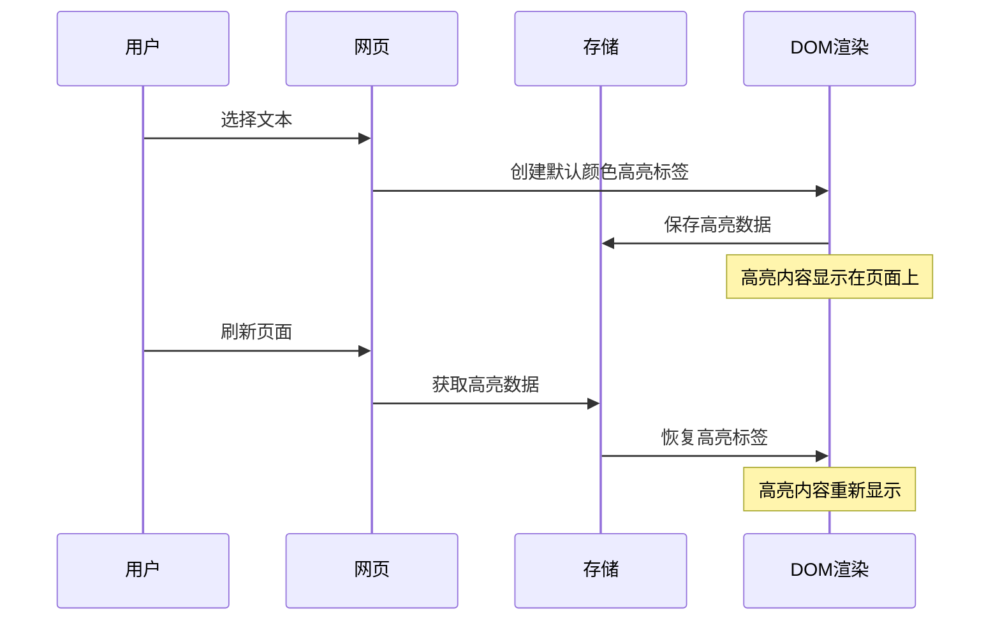
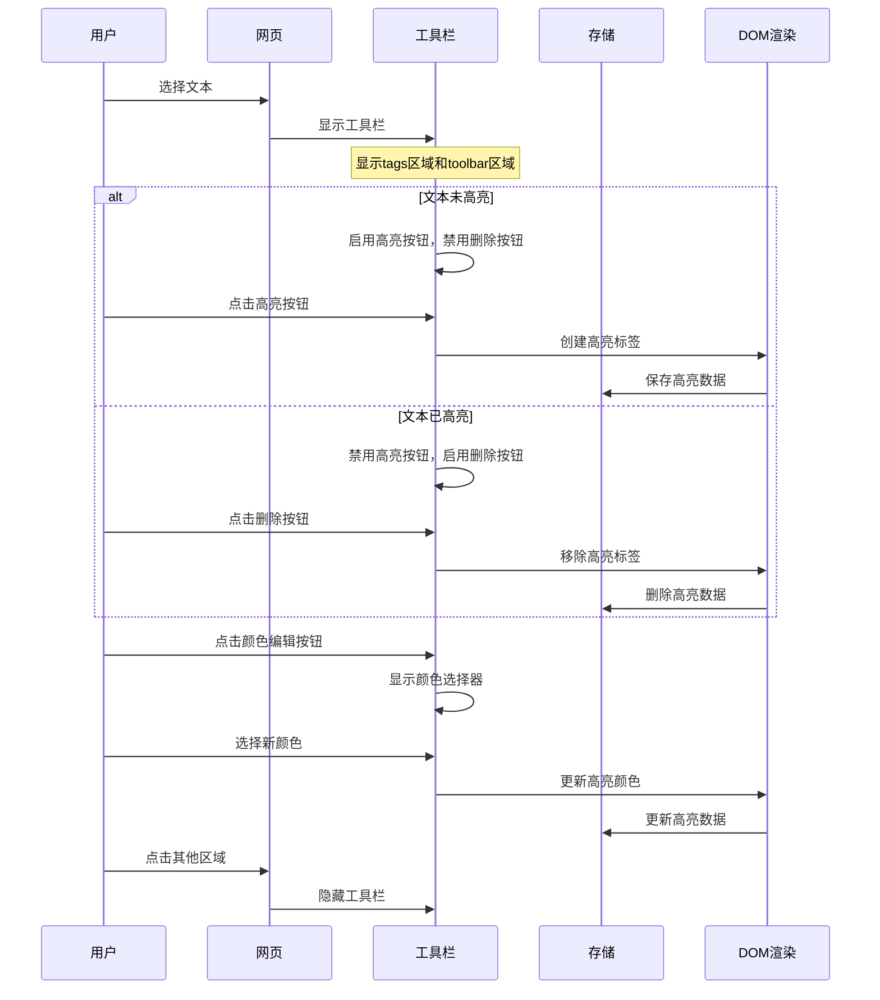

# highlight任务

## 任务 1：实现基础划词高亮功能

### 实现思路

**交互文字描述：**
用户在网页上选择文本后，自动使用默认颜色创建高亮标签，高亮内容以 `<effikit-highlight>` 标签形式保存在DOM中，页面刷新后自动恢复高亮内容。

**交互流程图：**


### 技术方案

**核心组件：**
1. **content-script.ts**
   - 监听文本选择事件 (`mouseup`, `keyup`)
   - 页面加载时恢复高亮内容
   - 集成现有存储和工具函数

2. **ui folder**
   - 新增 HighlightElement.ts,用于定义<effikit-highlight>自定义元素.
   
3. **dom.ts**
   - 新增 applyHighlight 函数
   - 新增 removeHighlight 函数

**数据结构：**
```typescript
interface Highlight {
  id: string;
  text: string;
  url: string;
  range: {
    startContainer: string;
    startOffset: number;
    endContainer: string;
    endOffset: number;
  };
  createdAt: string;
}
```

**高亮标签格式：**
```html
<effikit-highlight 
  data-highlight-id="unique-id"
  style="background-color: #fff3cd;"
>
  高亮内容
</effikit-highlight>
```

### 预期效果

1. **用户体验：**
   - 选择文本后立即创建高亮标签
   - 文本立即以默认颜色高亮显示
   - 页面刷新后高亮内容自动恢复
   - 界面响应流畅，无明显延迟

2. **视觉效果：**
   - 高亮文本以 `<effikit-highlight>` 标签形式存在于DOM中
   - 使用默认黄色高亮效果（#fff3cd）
   - 高亮效果清晰可见，不影响原文阅读

3. **技术指标：**
   - 高亮数据持久化存储在 chrome.storage.local
   - 支持跨页面高亮内容恢复
   - DOM操作性能优化，不影响页面加载速度
   - 代码遵循项目规范，使用命名导出和TypeScript严格模式

### 知识点

#### Reverse Selection（反向选择）处理机制

**概念说明：**
在浏览器的 Selection API 中，用户可以从左到右（文档顺序）或从右到左（反向文档顺序）进行选择。当用户从右到左选择文本时，就形成了 reverse selection（反向选择）。

- **anchorNode**: 选择开始的节点（用户开始拖拽的位置）
- **focusNode**: 选择结束的节点（用户结束拖拽的位置）
- **正向选择**: anchorNode 在文档中位于 focusNode 之前
- **反向选择**: anchorNode 在文档中位于 focusNode 之后

**`getTextNodesFromRange` 函数的处理方式：**

1. **Range 对象的自动规范化**
   - 当从 Selection 获取 Range 对象时，Range 对象会自动将起始和结束位置规范化
   - 确保 `startContainer/startOffset` 总是在文档中位于 `endContainer/endOffset` 之前
   - 无论原始选择的方向如何，都会得到一致的结果

2. **函数处理逻辑**
   - **边界对齐**: 使用 `splitText` 确保选区边界与文本节点边界对齐
   - **节点遍历**: 使用 `TreeWalker` 遍历 `range.commonAncestorContainer` 内的所有文本节点
   - **范围检查**: 通过 `range.intersectsNode(node)` 判断节点是否在选区内
   - **顺序收集**: 按文档顺序收集文本节点

3. **关键技术点**
   - `Range.intersectsNode()` 方法会正确判断节点是否与范围相交，不受原始选择方向影响
   - `TreeWalker` 始终按文档顺序遍历节点，确保结果的一致性
   - 最终返回的文本节点数组总是按照它们在文档中的出现顺序排列

**实际意义：**
通过依赖 Range API 的规范化特性和 TreeWalker 的文档顺序遍历，`getTextNodesFromRange` 函数天然地处理了 reverse selection 的情况。无论用户是从左到右还是从右到左进行选择，函数都会返回相同的、按文档顺序排列的文本节点数组，使得高亮功能的行为保持一致。

## 任务 2：实现高亮工具栏功能

### 实现思路

**交互文字描述：**
用户在网页上选择文本后，显示一个浮动工具栏，包含tags区域和toolbar区域。toolbar区域包含高亮按钮、颜色编辑按钮和删除按钮，用户可以通过工具栏来控制高亮的创建、编辑和删除操作。

**交互流程图：**


### 技术方案

**核心组件：**
1. **HighlightToolbar.ts**
   - 基于ReactCustomElement创建浮动工具栏UI组件
   - 管理工具栏的显示/隐藏状态
   - 处理工具栏按钮的点击事件
   - 根据选择区域的高亮状态控制按钮启用/禁用
   - HighlightToolbar需保持single instance,在页面加载时创建,在页面卸载时销毁.
   - 你可以使用 https://floating-ui.com/ 处理气泡相关的逻辑.

2. **content-script.ts 修改**
   - 移除mouseup事件中的直接高亮创建逻辑
   - 添加工具栏显示逻辑
   - 集成工具栏与现有高亮功能
   - 注册更新highlight状态的自定义事件, 当用户点击工具栏按钮时, 会触发该事件.
   1. upsert highlight
   2. delete highlight

3. **ColorPicker.ts**
   - 实现颜色选择器组件
   - 提供预设颜色选项
   - 支持自定义颜色输入

**工具栏结构：**
```html
<div class="effikit-highlight-toolbar">
  <!-- Tags Area -->
  <div class="tags-area">
    <div class="tags-placeholder">标签区域（待实现）</div>
  </div>
  
  <!-- Toolbar Actions -->
  <div class="toolbar-actions">
    <button class="highlight-btn" data-action="highlight">
      高亮
    </button>
    <button class="color-btn" data-action="color">
      颜色
    </button>
    <button class="delete-btn" data-action="delete">
      删除
    </button>
  </div>
</div>
```

**按钮状态管理：**
```typescript
interface ToolbarState {
  isHighlighted: boolean;
  selectedColor: string;
  position: { x: number; y: number };
  visible: boolean;
}

interface ToolbarActions {
  showToolbar: (selection: Selection, position: { x: number; y: number }) => void;
  hideToolbar: () => void;
}
```

### 预期效果

1. **用户体验：**
   - 选择文本后立即显示浮动工具栏
   - 工具栏位置跟随选择区域，不遮挡选中文本
   - 按钮状态根据当前选择区域的高亮状态动态更新
   - 点击页面其他区域时工具栏自动隐藏
   - 操作响应流畅，无明显延迟

2. **视觉效果：**
   - 工具栏采用现代化设计，与页面风格协调
   - Tags区域显示占位内容，为后续功能预留空间
   - 按钮有明确的启用/禁用视觉状态
   - 颜色选择器提供直观的颜色预览
   - 工具栏有适当的阴影和边框效果

3. **功能特性：**
   - 高亮按钮：仅在未高亮文本时可用
   - 删除按钮：仅在已高亮文本时可用
   - 颜色编辑按钮：始终可用，支持新建和编辑高亮颜色
   - 工具栏定位：智能避开页面边界，确保完全可见
   - 键盘支持：支持ESC键隐藏工具栏

4. **技术指标：**
   - 工具栏组件模块化设计，易于扩展和维护
   - 使用事件委托优化性能
   - 支持多种颜色格式（HEX、RGB、HSL）
   - 工具栏状态与高亮数据同步
   - 代码遵循项目规范，使用命名导出和TypeScript严格模式

### 任务拆解

#### 子任务1：创建HighlightToolbar组件基础结构
- **实现功能：** 创建基于ReactCustomElement的浮动工具栏UI组件
- **怎么实现：** 
  - 创建 `HighlightToolbar.tsx` 文件
  - 使用ReactCustomElement框架创建工具栏组件
  - 实现基础的组件结构. TagsArea 和 ToolbarActions不用单独新建文件实现,只需要在 HighlightToolbar.tsx 中实现即可. 
  ```tsx
    function HighlightToolbar(props: HighlightToolbarProps) {
      return (
        <div class="effikit-highlight-toolbar">
          <TagsArea />
          <ToolbarActions />
        </div>
      );
    }
  ```
  - 添加基础CSS样式，阴影效果等
  - 实现单例模式，确保页面只有一个工具栏实例

#### 子任务2：集成floating-ui实现智能定位
- **实现功能：** 使用floating-ui库实现工具栏的智能定位逻辑
- **怎么实现：**
  - 安装并配置floating-ui依赖
  - 实现工具栏相对于选择区域的定位计算
  - 添加边界检测，确保工具栏不会超出视窗范围
  - 实现位置自动调整（上方/下方切换）

#### 子任务3：实现工具栏显示/隐藏逻辑
- **实现功能：** 管理工具栏的显示和隐藏状态
- **怎么实现：**
  - 在HighlightToolbar中实现 `showToolbar()` 和 `hideToolbar()` 方法
  - 添加淡入淡出动画效果
  - 实现点击页面其他区域时自动隐藏
  - 添加ESC键隐藏功能
  - 处理窗口滚动时的工具栏位置更新

#### 子任务4：修改content-script.ts集成工具栏
- **实现功能：** 移除原有的直接高亮逻辑，集成新的工具栏功能
- **怎么实现：**
  - 移除 `handleTextSelection` 中的直接高亮创建逻辑
  - 添加工具栏显示逻辑到文本选择处理函数
  - 注册自定义事件监听器（upsert highlight、delete highlight）
  - 实现工具栏按钮点击事件的处理逻辑
  - 确保工具栏与现有高亮功能的数据同步

#### 子任务5：实现工具栏按钮状态管理
- **实现功能：** 根据选择区域的高亮状态动态控制按钮启用/禁用
- **怎么实现：**
  - 定义 `ToolbarState` 接口管理工具栏状态
  - 实现检测选择区域是否已高亮的逻辑
  - 根据高亮状态控制高亮按钮和删除按钮的启用状态
  - 添加按钮的视觉状态样式（启用/禁用）
  - 实现状态变化时的按钮更新逻辑

#### 子任务7：创建ColorPicker颜色选择器组件
- **实现功能：** 实现独立的颜色选择器组件
- **怎么实现：**
  - 创建 `ColorPicker.ts` 文件
  - 实现预设颜色选项的UI界面
  - 添加自定义颜色输入功能（color input）
  - 实现颜色格式转换（HEX、RGB、HSL）
  - 添加颜色预览功能
  - 实现颜色选择的回调机制

#### 子任务8：实现工具栏按钮功能
- **实现功能：** 实现高亮、颜色编辑、删除三个按钮的具体功能
- **怎么实现：**
  - 实现高亮按钮：调用现有的高亮创建逻辑
  - 实现删除按钮：调用现有的高亮删除逻辑
  - 实现颜色按钮：显示/隐藏颜色选择器
  - 处理颜色选择器的颜色变更事件
  - 实现高亮颜色的实时更新功能

#### 子任务9：添加工具栏样式和动画
- **实现功能：** 完善工具栏的视觉效果和交互动画
- **怎么实现：**
  - 设计现代化的工具栏UI样式
  - 添加按钮的hover、active状态样式
  - 实现工具栏的淡入淡出动画
  - 添加按钮点击的反馈动画
  - 确保工具栏样式与页面风格协调
  - 实现响应式设计，适配不同屏幕尺寸
