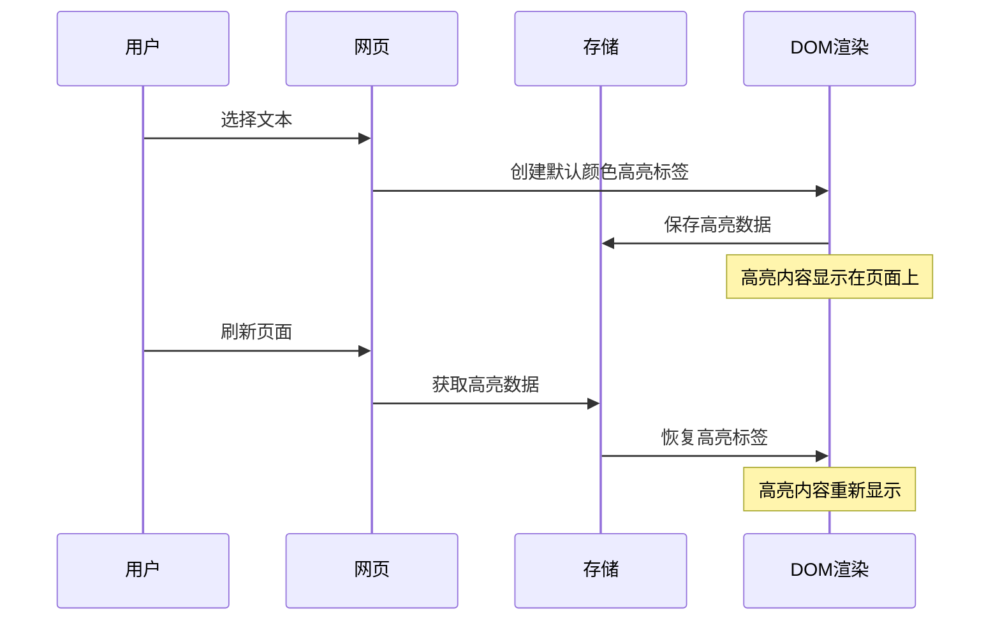

# highlight任务

## 任务 1：实现基础划词高亮功能

### 实现思路

**交互文字描述：**
用户在网页上选择文本后，自动使用默认颜色创建高亮标签，高亮内容以 `<effikit-highlight>` 标签形式保存在DOM中，页面刷新后自动恢复高亮内容。

**交互流程图：**


### 技术方案

**核心组件：**
1. **content-script.ts**
   - 监听文本选择事件 (`mouseup`, `keyup`)
   - 页面加载时恢复高亮内容
   - 集成现有存储和工具函数

2. **ui folder**
   - 新增 HighlightElement.ts,用于定义<effikit-highlight>自定义元素.
   
3. **dom.ts**
   - 新增 applyHighlight 函数
   - 新增 removeHighlight 函数

**数据结构：**
```typescript
interface Highlight {
  id: string;
  text: string;
  url: string;
  range: {
    startContainer: string;
    startOffset: number;
    endContainer: string;
    endOffset: number;
  };
  createdAt: string;
}
```

**高亮标签格式：**
```html
<effikit-highlight 
  data-highlight-id="unique-id"
  style="background-color: #fff3cd;"
>
  高亮内容
</effikit-highlight>
```

### 预期效果

1. **用户体验：**
   - 选择文本后立即创建高亮标签
   - 文本立即以默认颜色高亮显示
   - 页面刷新后高亮内容自动恢复
   - 界面响应流畅，无明显延迟

2. **视觉效果：**
   - 高亮文本以 `<effikit-highlight>` 标签形式存在于DOM中
   - 使用默认黄色高亮效果（#fff3cd）
   - 高亮效果清晰可见，不影响原文阅读

3. **技术指标：**
   - 高亮数据持久化存储在 chrome.storage.local
   - 支持跨页面高亮内容恢复
   - DOM操作性能优化，不影响页面加载速度
   - 代码遵循项目规范，使用命名导出和TypeScript严格模式

### 知识点

#### Reverse Selection（反向选择）处理机制

**概念说明：**
在浏览器的 Selection API 中，用户可以从左到右（文档顺序）或从右到左（反向文档顺序）进行选择。当用户从右到左选择文本时，就形成了 reverse selection（反向选择）。

- **anchorNode**: 选择开始的节点（用户开始拖拽的位置）
- **focusNode**: 选择结束的节点（用户结束拖拽的位置）
- **正向选择**: anchorNode 在文档中位于 focusNode 之前
- **反向选择**: anchorNode 在文档中位于 focusNode 之后

**`getTextNodesFromRange` 函数的处理方式：**

1. **Range 对象的自动规范化**
   - 当从 Selection 获取 Range 对象时，Range 对象会自动将起始和结束位置规范化
   - 确保 `startContainer/startOffset` 总是在文档中位于 `endContainer/endOffset` 之前
   - 无论原始选择的方向如何，都会得到一致的结果

2. **函数处理逻辑**
   - **边界对齐**: 使用 `splitText` 确保选区边界与文本节点边界对齐
   - **节点遍历**: 使用 `TreeWalker` 遍历 `range.commonAncestorContainer` 内的所有文本节点
   - **范围检查**: 通过 `range.intersectsNode(node)` 判断节点是否在选区内
   - **顺序收集**: 按文档顺序收集文本节点

3. **关键技术点**
   - `Range.intersectsNode()` 方法会正确判断节点是否与范围相交，不受原始选择方向影响
   - `TreeWalker` 始终按文档顺序遍历节点，确保结果的一致性
   - 最终返回的文本节点数组总是按照它们在文档中的出现顺序排列

**实际意义：**
通过依赖 Range API 的规范化特性和 TreeWalker 的文档顺序遍历，`getTextNodesFromRange` 函数天然地处理了 reverse selection 的情况。无论用户是从左到右还是从右到左进行选择，函数都会返回相同的、按文档顺序排列的文本节点数组，使得高亮功能的行为保持一致。