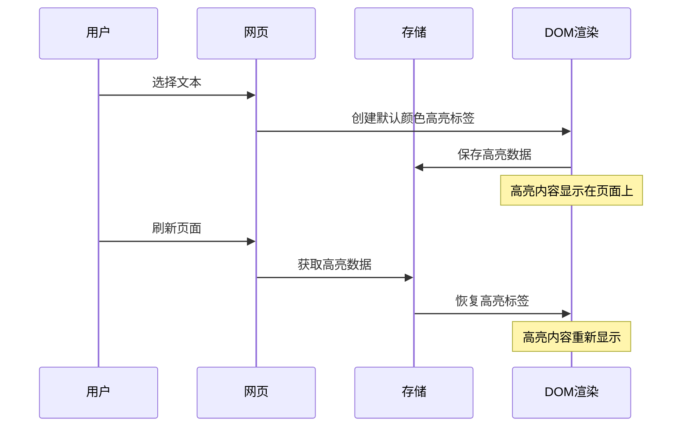

# highlight任务

## 任务 1：实现基础划词高亮功能

### 实现思路

**交互文字描述：**
用户在网页上选择文本后，自动使用默认颜色创建高亮标签，高亮内容以 `<effikit-highlight>` 标签形式保存在DOM中，页面刷新后自动恢复高亮内容。

**交互流程图：**


### 技术方案

**核心组件：**
1. **content-script.ts**
   - 监听文本选择事件 (`mouseup`, `keyup`)
   - 页面加载时恢复高亮内容
   - 集成现有存储和工具函数

2. **ui folder**
   - 新增 HighlightElement.ts,用于定义<effikit-highlight>自定义元素.
   
3. **dom.ts**
   - 新增 applyHighlight 函数
   - 新增 removeHighlight 函数

**数据结构：**
```typescript
interface Highlight {
  id: string;
  text: string;
  url: string;
  range: {
    startContainer: string;
    startOffset: number;
    endContainer: string;
    endOffset: number;
  };
  createdAt: string;
}
```

**高亮标签格式：**
```html
<effikit-highlight 
  data-highlight-id="unique-id"
  style="background-color: #fff3cd;"
>
  高亮内容
</effikit-highlight>
```

### 预期效果

1. **用户体验：**
   - 选择文本后立即创建高亮标签
   - 文本立即以默认颜色高亮显示
   - 页面刷新后高亮内容自动恢复
   - 界面响应流畅，无明显延迟

2. **视觉效果：**
   - 高亮文本以 `<effikit-highlight>` 标签形式存在于DOM中
   - 使用默认黄色高亮效果（#fff3cd）
   - 高亮效果清晰可见，不影响原文阅读

3. **技术指标：**
   - 高亮数据持久化存储在 chrome.storage.local
   - 支持跨页面高亮内容恢复
   - DOM操作性能优化，不影响页面加载速度
   - 代码遵循项目规范，使用命名导出和TypeScript严格模式